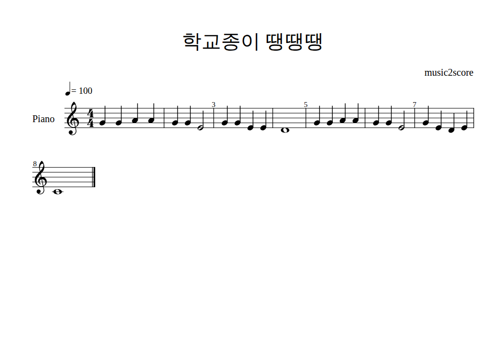
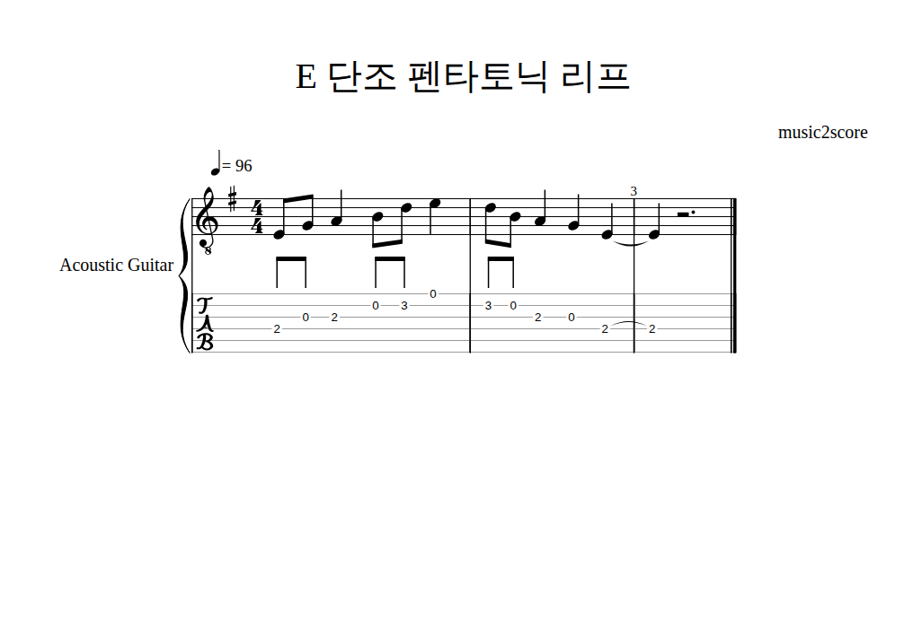
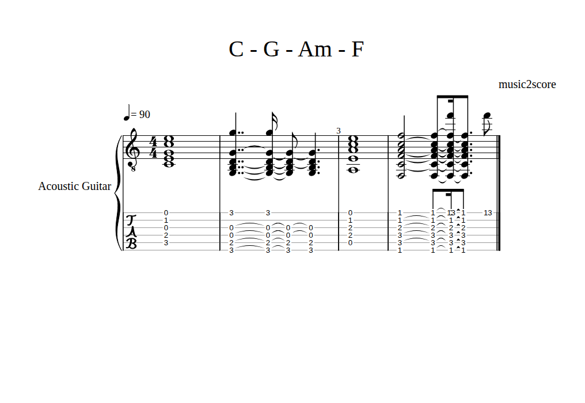
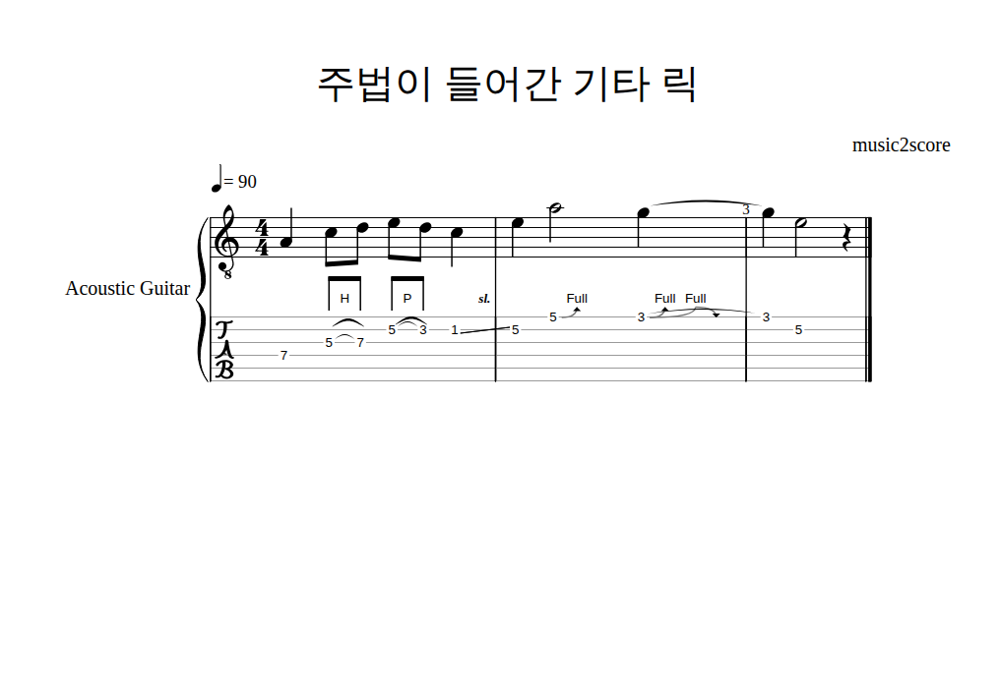
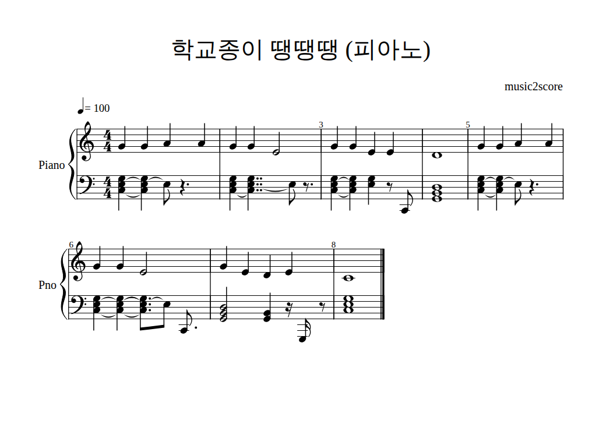

# music2score 🎼

음악을 **듣고 악보를 만드는** 프로그램입니다.
오디오 파일(또는 마이크 녹음)을 넣으면 음높이·박자·템포·조성을 분석해서
**MusicXML**(MuseScore 등 악보 프로그램용), **MIDI**, 브라우저에서 바로 보는 **HTML 악보**를 만듭니다.
기타·베이스·우쿨렐레 **타브(TAB) 악보**도 만들 수 있고, **해머링·풀링·슬라이드·벤딩** 같은 주법도 소리에서 읽어 표기합니다.
밴드 음원(MP3)이면 **베이스 소리만 떼어 내서** 베이스 타브를 만들 수 있습니다. → [타브 악보](#타브-악보) · [주법](#주법-해머링풀링슬라이드벤딩) · [밴드 음원에서 악기 분리](#밴드-음원에서-악기-분리)



> 위 악보는 비브라토와 잡음을 섞어 합성한 "학교종이 땡땡땡" 오디오를 넣어서 나온 결과 그대로입니다.
> 템포(♩=100), 조성(다장조), 음 24개의 높이와 길이가 모두 원곡과 일치합니다.

<br>

## 설치

Python 3.10 이상이 필요합니다.

```bash
cd music2score
pip install -e .                 # 기본 (노래·멜로디 인식)
pip install -e ".[poly]"         # + 피아노처럼 화음이 있는 연주 인식 (TensorFlow 포함, 큼)
pip install -e ".[mic]"          # + 마이크 녹음
pip install -e ".[separate]"     # + 밴드 음원에서 베이스 등 악기 분리 (--stem)
```

<br>

## 사용법

```bash
# 오디오 파일 → 악보
music2score 노래.wav
music2score 허밍.mp3 --title "내가 만든 노래"

# 마이크로 10초 녹음해서 바로 악보로
music2score --record 10

# 피아노 연주 (오른손/왼손 큰보표로)
music2score 피아노.mp3 --mode poly

# 템포·박자를 알고 있으면 알려 주면 더 정확합니다
music2score 왈츠.wav --bpm 90 --time 3/4

# 기타 타브 악보 (한 줄 멜로디·리프 / 코드 스트로크). 주법 기호도 붙는다
music2score 기타리프.wav --tab guitar
music2score 기타코드.wav --mode poly --tab guitar --capo 2

# 밴드 음원에서 베이스만 떼어 내 5현 베이스 타브로
music2score 노래.mp3 --stem bass --tab bass5

# 원곡에서 노래 멜로디만 떼어 내 일렉기타 타브로
music2score 원곡.mp3 --stem vocals --tab electric

# 반주·건반처럼 화음이 섞인 소리에서 선율 한 줄만 뽑아 일렉기타 타브로
music2score 건반.wav --mode melody --tab electric --grid 8

# 피아노가 멜로디인 곡: 건반 소리를 떼어 선율을 뽑고, 기타로 치기 좋게 한 옥타브 내려서
music2score 피아노곡.mp3 --stem other --mode melody --tab electric --transpose -12
```

설치 없이 폴더 안에서 `python -m music2score 노래.wav` 로 실행해도 됩니다.
wav · mp3 · flac · ogg 는 바로 읽고, m4a · aac 같은 형식은 [ffmpeg](https://ffmpeg.org) 가 설치돼 있어야 읽힙니다.
리눅스에서 마이크 녹음을 쓰려면 PortAudio 도 필요합니다 (`sudo apt install libportaudio2`).

직접 녹음한 파일이 없다면 데모 오디오로 먼저 써 보세요.

```bash
python examples/make_demo.py                              # examples/ 에 wav 네 개 생성
music2score examples/school_bell.wav
music2score examples/school_bell_piano.wav --mode poly
music2score examples/guitar_riff.wav --tab guitar
music2score examples/guitar_chords.wav --mode poly --tab guitar --bpm 90
```

실행하면 이렇게 나옵니다.

```
♪ 분석 중: examples/school_bell.wav
  템포  : ♩ = 100
  조성  : C 장조
  음 개수: 24  (G4 G4 A4 A4 G4 G4 E4 G4 G4 E4 E4 D4 G4 G4 A4 A4 …)
  결과  :
    musicxml output/school_bell.musicxml
    midi     output/school_bell.mid
    html     output/school_bell.html
```

### 옵션

| 옵션 | 설명 | 기본값 |
|---|---|---|
| `--mode mono` | 노래, 허밍, 휘파람, 리코더·바이올린 같은 **멜로디 한 줄** | ✔ |
| `--mode poly` | 피아노·기타처럼 **여러 음이 동시에** 울리는 연주 (basic-pitch 필요) | |
| `--mode melody` | 화음·반주가 섞인 소리에서 **가장 두드러진 선율 한 줄**만 (basic-pitch 필요) | |
| `--record SEC` | 파일 대신 마이크로 SEC 초 녹음 (sounddevice 필요) | |
| `--bpm` | 템포 직접 지정 | 자동 추정 |
| `--time` | 박자표 (`4/4`, `3/4`, `6/8` …) | `4/4` |
| `--grid` | 가장 짧은 음표 (`8` = 8분음표, `16` = 16분음표) | `16` |
| `--min-note` | 이보다 짧은 음(초)은 잡음으로 보고 버림 | mono 0.06 / poly 0.12 |
| `--tab` | 타브 악보도 만들기: `guitar`, `electric`(일렉기타), `drop-d`, `bass`(4현), `bass5`(5현), `ukulele` | |
| `--capo N` | 카포 위치. 타브의 프렛 번호가 카포 기준이 됨 | `0` |
| `--stem` | 밴드 음원에서 이 악기만 떼어 낸 뒤 악보로: `bass`, `other`(기타·건반), `vocals`(노래), `drums` | |
| `--transpose N` | 반음 N 개만큼 옮겨 적기. 높은 피아노 선율을 기타로 칠 때 `-12`(한 옥타브 아래)면 중간 포지션으로 내려온다 | `0` |
| `--title` | 악보 제목 | 파일 이름 |
| `-o`, `--out` | 결과 폴더 | `output` |
| `--pdf` | PDF 도 생성 (MuseScore 설치 필요) | |

### 결과 파일

| 파일 | 쓰는 곳 |
|---|---|
| `*.musicxml` | [MuseScore](https://musescore.org)(무료), Finale, Sibelius, Dorico 에서 열어 **수정·인쇄** |
| `*.mid` | DAW, GarageBand, 피아노 앱 등에서 재생 |
| `*.html` | 더블클릭해서 브라우저로 바로 보기 ([OpenSheetMusicDisplay](https://opensheetmusicdisplay.org)) |
| `*.tab.txt` | `--tab` 을 주면 생기는 글자 타브. 메모장·커뮤니티 게시판에 그대로 붙여 넣기 |

자동 인식 결과는 초안입니다. MusicXML 을 MuseScore 에서 열어 틀린 음만 고치면 완성본을 빠르게 만들 수 있습니다.

<br>

## 타브 악보

`--tab guitar` 를 붙이면 오선 악보 아래에 TAB 보표가 붙고(MusicXML·HTML), 글자 타브(`.tab.txt`)도 만듭니다.
MusicXML 에는 표준 TAB 보표(음마다 줄·프렛 번호, 줄마다 조율 정보)로 저장되므로 악보 프로그램에서 이어서 편집할 수 있습니다.



```
E 단조 펜타토닉 리프
기타 표준 (E A D G B E) | ♩ = 96 | 4/4

  1
e|-------------0---|-----------------|-----------------|
B|---------0-3-----|-3-0-------------|-----------------|
G|---0-2-----------|-----2---0-------|-----------------|
D|-2---------------|-------------2---|-----------------|
A|-----------------|-----------------|-----------------|
E|-----------------|-----------------|-----------------|
```

> 기타 소리(Karplus-Strong 뜯는 줄)로 합성한 리프를 넣은 결과입니다. 음 11개의 높이·박자가 모두 정답과 같습니다.
> 글자 타브는 가로 간격이 박자에 비례합니다 (한 칸 = 8분음표, 16분음표가 있으면 16분음표).

| 악기 (`--tab`) | 조율 (낮은 줄 → 높은 줄) |
|---|---|
| `guitar` / `electric` | E A D G B E (통기타 / 일렉기타, 둘 다 벤딩을 읽는다) |
| `drop-d` | D A D G B E |
| `bass` | E A D G (4현) |
| `bass5` | B E A D G (5현, 가장 낮은 B0 까지) |
| `ukulele` | G C E A (G 가 높은 리엔트런트 조율) |

### 줄과 프렛은 어떻게 정하나

기타는 같은 음을 여러 자리에서 낼 수 있습니다. 예를 들어 E4(미) 는 1번 줄 개방현, 2번 줄 5프렛, 3번 줄 9프렛, 4번 줄 14프렛 모두 같은 소리입니다.
음 하나씩 "가장 낮은 프렛"을 고르면 손이 지판 위를 널뛰기 때문에, [tab.py](music2score/tab.py) 는 곡 전체를 한 번에 보고
**손 이동 + 높은 포지션 + 손가락 벌림** 비용이 가장 작은 운지를 동적 계획법(비터비)으로 찾습니다.

- 상태 = (운지, 검지 위치). 검지가 h 프렛에 있으면 h ~ h+3 프렛은 손을 옮기지 않고 누를 수 있다고 봅니다.
- 포지션을 옮길 때마다 고정 비용 + 거리 비용, 높은 프렛일수록 약간의 비용, 화음은 누르는 프렛 폭이 4칸을 넘으면 불가능.
- 개방현은 손 위치와 상관없이 칠 수 있습니다.

그 결과 코드는 교본에 나오는 모양 그대로 나옵니다 (모두 테스트로 확인).

| 코드 | C | G | D | Am | E | F (바레) | 카포 2 의 D | 우쿨렐레 C |
|---|---|---|---|---|---|---|---|---|
| 운지 (6번 줄 → 1번 줄) | `x32010` | `320003` | `xx0232` | `x02210` | `022100` | `133211` | `x32010` | `0003` |

노래 멜로디처럼 악기 음역을 벗어나는 음은 옥타브를 옮겨서 넣고(`mono`), 그 악기를 녹음한 화음(`poly`)에서
음역 밖 음이 나오면 잘못 인식한 음으로 보고 뺍니다. 한 손으로 잡을 수 없는 화음은 가운데 음부터 뺍니다.

### 코드 스트로크 (`--mode poly --tab guitar`)



> C - G - Am - F 스트로크를 합성해서 넣은 결과. 네 코드 모두 정확한 자리(`x32010`, `320003`, `x02210`, `133211`)로 나오지만,
> 소리가 사그라들면서 모델이 몇몇 음을 다시 잡아 2·4마디에 붙임줄과 잔음표가 생겼습니다. 이런 음은 MuseScore 에서 지우면 됩니다.

- 스트로크는 줄을 위에서 아래로 긁으므로 음마다 시작이 조금씩 어긋납니다. 0.15초 안에 이어서 시작한 음들은 한 화음으로 묶습니다.
- 한 번에 긁은 줄들은 함께 울리므로 같은 길이로 맞춥니다.
- 마디마다 코드 하나만 치는 곡은 템포를 정할 근거가 부족하니 `--bpm` 을 알려 주세요.

<br>

## 주법 (해머링·풀링·슬라이드·벤딩)

`--tab` 을 주면 한 줄 연주(`mono`)에서 왼손 주법을 소리로 읽어 타브에 적습니다.



```
e|-------------------|------5b7-------3b5r3---|------------------|
B|----------5-p3-1---|-/5---------------------|-----5\-----------|
G|-----5-h7----------|------------------------|------------------|
D|-7-----------------|------------------------|------------------|

h 해머링 · p 풀링 · / \ 슬라이드 (앞뒤에 붙으면 미끄러져 들어옴/빠짐) · 7b9 벤딩 · r 릴리즈
```

> 해머링·풀링·슬라이드·온음 벤딩·벤딩 후 릴리즈·슬라이드 아웃을 넣어 합성한 릭을 넣은 결과. 음·박자·주법 모두 정답과 같습니다.

| 주법 | 소리에서 보이는 모습 | 글자 타브 | MusicXML |
|---|---|---|---|
| 해머링 | 다시 치지 않고(음량이 안 오름) 음높이가 **한순간에** 올라감 | `5h7` | `<hammer-on>` + 이음줄 |
| 풀링 | 다시 치지 않고 음높이가 **한순간에** 내려감 | `7p5` | `<pull-off>` + 이음줄 |
| 슬라이드 | 다시 치지 않고 음높이가 **미끄러지듯** 이동 | `5/7`, `7\5` | `<slide>` |
| 벤딩 (기타) | 위로 3반음 이내로 미끄러지듯 올라감 | `7b9` | `<bend><bend-alter>` |
| 릴리즈 | 벤딩 뒤 원래 음으로 미끄러지듯 내려옴 | `7b9r7` | `<bend>` + `<release/>` |
| 슬라이드 인 / 아웃 | 음 앞/끝에서 2반음 이상 미끄러짐 | `/7`, `7\` | `<scoop/>` `<plop/>` / `<doit/>` `<falloff/>` |

어떻게 구분하나 ([mono.py](music2score/mono.py))
1. **어택(피킹)과 무음**을 경계로 "한 번 친 소리"로 나눕니다. onset 검출기가 놓쳐도 음량이 3dB 이상 다시 오르면 새로 친 음입니다.
2. 한 번 친 소리 안에서 음높이가 **머무는 구간**을 음으로 봅니다. 비브라토(초당 5~6번 흔들림)는 약 0.1초 이동 평균으로 누그러뜨려 한 음으로 둡니다.
3. 두 음 사이 **중간 음높이에 머문 시간**을 잽니다. pYIN 분석 창이 음을 번지게 하는 시간(기타 약 46ms, 베이스 약 70ms) 이내면
   순간 이동 → 해머링·풀링, 그보다 길면 미끄러짐 → 슬라이드·벤딩. 해머링·풀링은 손을 옮기지 않고 닿는 4프렛(반음 4개) 이내만 인정합니다.
4. 미끄러짐이 슬라이드인지 벤딩인지는 소리만으로는 비슷해서 악기로 정합니다: **기타에서 위로 3반음 이내 → 벤딩**, 그 외·베이스·우쿨렐레 → 슬라이드.
5. 줄·프렛을 고를 때 해머링·풀링·슬라이드로 이어진 두 음은 **같은 줄**에 놓고, 벤딩·슬라이드 음은 개방현에 놓지 않습니다.

기타 음역(가장 낮은 음 75Hz 이상)은 전이가 또렷하게 보이도록 pYIN 분석 창을 46ms 로 줄이고, 베이스·노래는 저음을 잡기 위해 93ms 를 씁니다.

> HTML 뷰어(OpenSheetMusicDisplay)는 해머링(H)·풀링(P)·슬라이드(sl.)·벤딩(½, Full 화살표)을 그리지만
> 슬라이드 인/아웃 기호는 보이지 않을 수 있습니다. 글자 타브와 MusicXML 에는 들어 있습니다.

<br>

## 밴드 음원에서 악기 분리

드럼·베이스·건반이 섞인 음원은 그대로 넣으면 모든 악기의 음이 한데 섞입니다. `--stem` 을 주면 먼저 그 악기 소리만 떼어 냅니다.

```bash
pip install -e ".[separate]"
music2score 반주.mp3 --stem bass --tab bass5                 # 베이스만 떼어 5현 베이스 타브로
music2score 반주.mp3 --stem other --mode poly                 # 기타·건반 소리 (화음)
music2score 원곡.mp3 --stem vocals --tab electric             # 노래 멜로디를 일렉기타 타브로
music2score 반주.mp3 --stem other --mode melody --tab electric # 건반의 맨 위 선율을 일렉기타 타브로
```

- 분리 모델은 [KUIELab](https://github.com/kuielab/mdx-net) 의 MDX-Net(2021 Music Demixing Challenge) 입니다. 처음 쓸 때 [UVR](https://github.com/Anjok07/ultimatevocalremovergui) 프로젝트가 GitHub 에 올려 둔 ONNX 파일(악기당 약 30MB)을 `~/.cache/music2score` 에 내려받습니다.
- 3분 곡을 CPU 로 분리하는 데 1~2분 걸립니다. 떼어 낸 소리는 결과 폴더에 `이름.bass.wav` 로 남고, 다시 실행하면 그 파일을 씁니다.
- 떼어 낸 소리 셋(베이스·드럼·나머지)을 더하면 원곡과 12dB SDR 정도로 맞습니다 (실제 반주 음원으로 확인).
- 베이스 라인은 한 줄이라 `mono` 로 잘 읽힙니다. 기타·건반(`other`)은 보통 여러 음을 동시에 쳐서 `poly` 로 읽어야 하고, 건반 화음은 기타로 잡을 수 없는 음이 많아 타브로는 초안 수준입니다.
- 노래(`vocals`)도 한 줄이라 `mono` 로 읽고, `--tab electric` 이면 노래의 끌어올림·꺾기가 기타의 벤딩·슬라이드로 적힙니다.
- **반주(MR) 음원에는 멜로디가 없습니다.** 멜로디를 따려면 노래나 리드 악기가 들어 있는 원곡을 넣으세요. 반주만 있을 때 `--mode melody` 로 뽑히는 것은 건반 반주의 맨 위 음 줄기라서, 화음 자리바꿈을 따라 음역이 자주 뜁니다.

### 화음 속 선율 한 줄 뽑기 (`--mode melody`)

basic-pitch 가 내놓는 "프레임마다 88건반 각각이 울릴 확률"에서, 곡 전체를 한 번에 보고 비터비로 선율 한 줄을 고릅니다 ([poly.py](music2score/poly.py)).

- 그 음이 울릴 확률이 높을수록, **높은 음일수록**(선율은 보통 반주 위에 있다), 음을 덜 바꾸고 가까운 음으로 갈수록 싼 길.
- 확률이 낮으면 쉼. 아주 약한 음은 높더라도 고르지 않고, 약하면서 짧은 음은 잔음으로 버립니다.
- `--tab` 과 함께 쓰면 그 악기로 낼 수 있는 음역 안에서만 찾습니다 (일렉기타 E2~D6).

피아노 반주(도-미-솔 화음) 위의 "학교종이 땡땡땡"을 넣으면 반주 음은 하나도 섞이지 않고 멜로디 24음이 박자까지 그대로 나옵니다 (테스트로 확인).

<br>

## 동작 원리

```
오디오 ─▶ ① 음 검출 ─▶ ② 템포 추정 ─▶ ③ 박자 양자화 ─▶ ④ 조성 추정 ─▶ ⑤ 악보 만들기
          (초 단위)                     (4분음표 단위)
```

**① 음 검출** — 소리에서 "몇 초부터 몇 초까지 어떤 음"인지 찾습니다.
- `mono` ([mono.py](music2score/mono.py)): **pYIN** 알고리즘으로 11.6ms 마다 기본 주파수(f0)를 구하고,
  - 음높이가 0.75 반음 이상 바뀐 상태가 이어지면 → 새 음
  - 같은 음높이라도 음량이 다시 치솟는 어택(onset)이 있으면 → 같은 음을 다시 부른 것 (솔-솔-라-라 구분)
  - 한두 프레임 인식이 끊긴 것은 다시 이어 붙이고, 잡음 바닥보다 작은 소리는 무시합니다.
- `poly` ([poly.py](music2score/poly.py)): Spotify 의 신경망 모델 **basic-pitch** 로 여러 음을 동시에 찾고,
  배음(옥타브 위에 약하게 따라 울리는 소리)이 따로 잡힌 가짜 음을 걸러 냅니다.

**② 템포 추정** ([rhythm.py](music2score/rhythm.py)) — 음이 시작되는 시각들이 반복되는 주기로 BPM 을 구한 뒤,
±6% 범위에서 음 시작점들이 박자 격자에 가장 잘 맞는 BPM 과 첫 박 위치를 다시 찾습니다.
(템포가 1%만 틀려도 곡 뒤쪽에서 박이 밀리기 때문입니다.)

**③ 박자 양자화** — 초 단위 시간을 16분음표 격자에 맞춥니다.
사람은 음을 악보 길이보다 조금 일찍 끊는 경우가 많아서, 그대로 옮기면 악보가 쉼표투성이가 됩니다.
그래서 곡 전체에서 **연주자가 음을 얼마나 끊어 부르는지**를 재고, 그 습관만큼의 틈은 앞 음에 붙이고
그보다 긴 틈만 쉼표로 적습니다. (끊어 부르는 사람의 "온음표"와 레가토로 부른 "점2분음표+4분쉼표"를 구분할 수 있습니다.)

**④ 조성 추정** ([score.py](music2score/score.py)) — 음 길이로 가중한 음 분포를 조성별 프로필과 비교(Krumhansl-Schmuckler)해서
조표를 정하고, 조성에 맞게 음 이름을 적습니다. (바장조면 A♯ 대신 B♭, 라단조면 D♭ 대신 C♯)

**⑤ 악보 만들기** — [music21](https://web.mit.edu/music21/) 로 마디·붙임줄·쉼표를 정리하고 MusicXML/MIDI 로 저장합니다.
`poly` 는 가온 도(C4)를 기준으로 오른손/왼손 큰보표로 나눕니다.

<br>

## 잘 되는 것과 한계

| 입력 | 결과 |
|---|---|
| 노래·허밍·휘파람·단선율 악기 독주 | 👍 잘 됩니다. 비브라토·약한 잡음·레가토/스타카토 모두 테스트로 확인 |
| 기타 한 줄 리프·솔로 → 타브 | 👍 음·박자·운지 모두 잘 됩니다 |
| 피아노 독주 | 🙂 멜로디와 화음 구성음은 잘 잡지만, 음 길이가 들쭉날쭉한 **초안** 수준 (아래 그림) |
| 기타 코드 스트로크 → 타브 | 🙂 코드 모양은 정확하지만 잔음표가 섞인 **초안** 수준 |
| 기타 한 줄 연주의 해머링·풀링·슬라이드·벤딩 | 👍 합성 소리로는 정확. 실제 녹음에서는 살살 친 음이 해머링으로, 빠른 슬라이드가 해머링으로 읽힐 수 있습니다 |
| 밴드 음원 → 베이스 타브 (`--stem bass`) | 🙂 베이스 라인은 잘 읽히고 슬라이드도 잡지만, 분리가 완벽하지 않아 빠른 음이나 박 위치가 가끔 틀립니다 |
| 반주·드럼이 섞인 일반 음원의 멜로디 (가요, 팝) | 😢 보컬 분리는 아직 없습니다. [Demucs](https://github.com/facebookresearch/demucs) 같은 도구로 **보컬만 뽑은 뒤** `mono` 로 넣으면 멜로디 악보를 얻을 수 있습니다. |



> 피아노 모드 결과. 오른손 멜로디는 정확하고 왼손 화음(도-미-솔, 솔-시-레)도 맞지만,
> 피아노 소리는 치고 나면 점점 작아지기 때문에 모델이 음 길이를 짧게/여러 번 잡아서 붙임줄이 지저분합니다.

그 밖의 한계
- 셋잇단음표는 지원하지 않습니다 (가장 가까운 16분음표 격자로 맞춤).
- 첫 음을 항상 첫 마디 첫 박으로 둡니다. 못갖춘마디(여린내기)로 시작하는 곡은 마디선이 밀릴 수 있습니다.
- 템포가 크게 변하는 곡(리타르단도, 루바토)은 뒤쪽 박자가 어긋날 수 있습니다. `--bpm` 을 지정하면 도움이 됩니다.
- 템포는 60~180 사이로 추정합니다. 실제로는 200 인 곡이 100 으로 잡히면 음표 길이가 절반이 될 뿐 악보는 맞습니다.
- 비브라토·트릴·하모닉스·뮤트·태핑 같은 다른 주법은 아직 표기하지 않습니다. 화음(`poly`)에서는 주법을 읽지 않습니다.
- 첫 음을 첫 박으로 두기 때문에, 반주 음원에서 베이스가 박 중간에 들어오면 마디선이 밀릴 수 있습니다.

<br>

## 테스트

```bash
pip install -e ".[dev,poly]"
pytest
```

정답을 아는 멜로디를 [synth.py](music2score/synth.py) 로 직접 합성해서 넣고, **음높이·시작 박·길이가 정답과 완전히 같은지** 확인합니다.
(학교종 / 바장조 8분·16분·점음표 멜로디 × 잡음·비브라토·빠른 템포·레가토·스타카토, 3/4 박자, 피아노 화음,
기타 코드 모양·카포·우쿨렐레·베이스, 기타 리프 → 타브, 코드 스트로크 → 타브,
기타·베이스 릭의 해머링·풀링·슬라이드·벤딩·릴리즈, 일반 피킹에 주법이 잘못 붙지 않는지, 악기 분리 조각 이어 붙이기,
반주 속 선율 뽑기, 옮겨 적기 등 52개)

<br>

## 폴더 구조

```
music2score/
├── music2score/
│   ├── __main__.py     # 명령줄 (music2score 명령)
│   ├── transcriber.py  # 전체 파이프라인 transcribe()
│   ├── audio.py        # 오디오 읽기, 마이크 녹음
│   ├── mono.py         # ① 단선율 음 검출 (pYIN) + 주법 읽기
│   ├── poly.py         # ① 다성 음 검출 (basic-pitch), 화음 속 선율 뽑기
│   ├── rhythm.py       # ② 템포 추정, ③ 박자 양자화
│   ├── score.py        # ④ 조성, ⑤ 악보 생성·내보내기
│   ├── tab.py          # 타브: 줄·프렛 고르기(비터비), 주법 표기, 글자 타브, TAB 보표
│   ├── separate.py     # 밴드 음원 악기 분리 (MDX-Net ONNX)
│   ├── synth.py        # 테스트/데모용 신시사이저
│   └── notes.py        # 자료형
├── examples/make_demo.py
└── tests/
```

파이썬 코드에서 직접 쓸 수도 있습니다.

```python
from pathlib import Path
from music2score import transcribe
from music2score.score import export

result = transcribe("노래.wav", mode="mono")
print(result.bpm, result.key)          # 예: 100.0 C major
export(result.score, Path("output"), "노래")

riff = transcribe("리프.wav", tab="guitar")
print(riff.tab_text())                 # 글자 타브
export(riff.score, Path("output"), "리프", tuning=riff.tuning)
```
